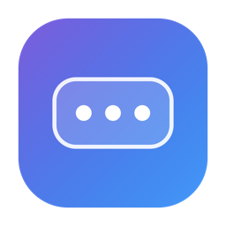

<div align="center">



# Dockbars

**A hidden pocket for your Dock.**

Push your pointer to the edge of the screen and a Liquid Glass panel slides out —
your apps, files, and snippets, one flick away. It extends the Dock. It never replaces it.

[**Download the latest DMG**](https://github.com/mehmetefeaytas/dockbars/releases/latest) · [**Website**](https://dockbars.vercel.app)


</div>

---

## What is it?

Dockbars is a **native macOS menu-bar app** that adds a hidden, hover-activated pocket next
to your Dock. Move the pointer to the corner beside the Dock and a translucent panel of your
favourite apps, files, folders, websites, Shortcuts, scripts, and text snippets slides out.
Click to open, drag to add or remove, glide away and it closes on its own.

It's designed to feel like a natural part of macOS — and to stay completely on your Mac.

## Features

- **Hidden pocket** that opens on hover, beside the Dock or from a screen edge you choose.
- **Multiple stashes** — group items into named sets (Work, Dev, Games) and switch with ⌘1–9.
- **Fuzzy search across every stash** — just start typing; arrow keys + Return to open.
- **Rich item types** — apps, files, folders, websites, Apple Shortcuts, shell scripts, and
  text snippets, each opening the right way.
- **Liquid Glass** panel with System / Light / Dark themes, grid **or** list view, icon sizes 16–128.
- **Favourites & pins**, **recently used**, and a **running-app indicator**.
- **Quick Peek** — hover a file for a second to preview it with Quick Look.
- **Widgets** — clock, battery, recent Downloads; optional **clipboard history**; **usage statistics**.
- **Multi-monitor** aware and **fullscreen aware** (hover suspends over fullscreen apps).
- **Global shortcut** (default ⌥Space, fully customizable) and **automation** via a
  `dockbars://` URL scheme, a CLI wrapper, and AppleScript.
- **Profiles** — switch appearance/layout presets from the menu bar.
- **Export / import** your configuration as JSON.
- **English & Turkish** localization (follows the system language).

## Privacy

Dockbars is **local-first and offline by design**:

- **No network code at all.** Nothing to opt out of, because nothing is ever sent.
- **No accounts, no telemetry, no analytics, no tracking.**
- Stashes, clipboard history, and statistics never leave your Mac.
- Icons are resolved from the system at runtime; nothing is written to disk as image data.

## Install

1. **[Download `Dockbars-x.y.z.dmg`](https://github.com/mehmetefeaytas/dockbars/releases/latest)**
   from the latest release.
2. Open the DMG and drag **Dockbars** into **Applications**.
3. Launch it. Because the app is signed but not yet notarized, macOS Gatekeeper shows a
   warning on first launch — **right-click the app → Open → Open** (only needed once).
4. Grant **Accessibility** access when prompted: **System Settings → Privacy & Security →
   Accessibility**. This is required so Dockbars can detect the pointer reaching the Dock edge
   and read the Dock's position. Dockbars requests **no** network access.

> Requires **macOS 15 (Sequoia) or later**, on Apple Silicon or Intel.

## Using it

- **Open:** hover the corner beside the Dock, click the menu-bar icon, press **⌥Space**, or run
  `dockbars://open` / `dockbars open`.
- **Add items:** drag from Finder/Launchpad/Dock into the panel, or use the header **+** menu
  (Files / URL / Shortcut / Script / Snippet).
- **Remove:** drag an item to the header trash, drag it out of the panel, or right-click → Remove.
- **Reorder:** drag an item onto another within a stash.
- **Search / keyboard:** move into the open panel, then type to fuzzy-search; ↑↓ to move,
  Return to open, Esc to clear/close, ⌘1–9 to switch stashes.
- **Right-click the menu-bar icon** for Settings, Profiles, Tutorial, and Quit.

### Automation

```bash
# URL scheme
open "dockbars://open"              # open the pocket
open "dockbars://open?stash=Work"   # select "Work" and open
open "dockbars://toggle"            # toggle

# CLI (install scripts/dockbars into your PATH)
dockbars open
dockbars open Work
dockbars toggle
```

```applescript
-- AppleScript, via the URL scheme
do shell script "open 'dockbars://open?stash=Work'"
```

## Build from source

Requires Xcode 26+ and [XcodeGen](https://github.com/yonaskolb/XcodeGen) (`brew install xcodegen`).

```bash
xcodegen generate
xcodebuild -project Dockbars.xcodeproj -scheme Dockbars -configuration Debug build
xcodebuild -project Dockbars.xcodeproj -scheme Dockbars -destination 'platform=macOS' test
```

### Package a DMG

```bash
./scripts/make-dmg.sh          # signs with your Apple Development identity + builds the DMG
```

### Notarize for distribution

For a Gatekeeper-clean build you need a **Developer ID Application** certificate and a
notarytool profile. `scripts/notarize.sh` then archives → exports → notarizes → staples; see
the script header for the one-time credential setup.

## Architecture

MVVM with an AppKit coordinator bridging into SwiftUI via `NSHostingView`. `AppState` is the
single source of truth.

```
Dockbars/
├── App/         main, AppDelegate (coordinator), AppState
├── Core/
│   ├── DockObserver/    Dock position/size/autohide detection + pure geometry
│   ├── HoverEngine/     global mouse monitor, hotkey, running/fullscreen/clipboard monitors
│   ├── PanelController/ non-activating NSPanel lifecycle + spring animation
│   └── Persistence/     SwiftData models, settings, profiles, JSON import/export
├── Features/    PocketPanel · Settings · MenuBar · Onboarding
├── Utilities/   icons, launcher, fuzzy match, shortcuts, layout, localization
├── Resources/   en.lproj / tr.lproj
└── Tests/       DockGeometry · HoverDebouncer · FuzzyMatch · PanelLayout · ConfigCodec
```

Key decisions: a non-activating borderless `NSPanel` that never steals focus; an
allocation-free hover hot path (a single cached rect test — idle CPU ≈ 0%, RAM in the tens of
MB); **App Sandbox intentionally disabled** because global mouse monitoring and Dock
inspection require Accessibility; zero third-party dependencies.

## Roadmap

Phases 1–4 are implemented. Planned next: **Sparkle** auto-update (opt-in; would be the app's
only network use) and a fuller String Catalog localization pass.

## License

TBD.
